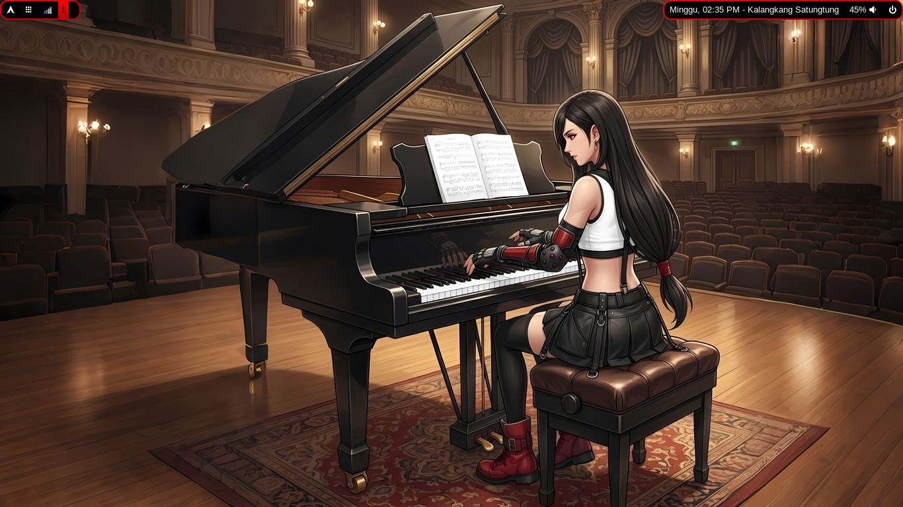
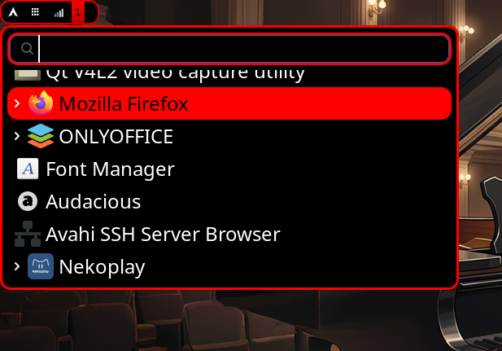
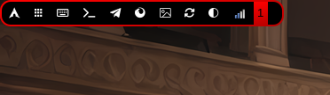
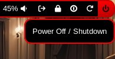
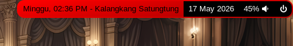

# Niri GTK

Dotfiles/Backup konfigurasi niri (beserta aplikasi pendukungnya: kebanyakan dari aplikasi GTK/Gnome/XFCE) bertema warna dan wallpaper Tifa. Fokus ke warna merah putih hitam sesuai tema pakaian Tifa. Semua konfigurasi berdasarkan kebutuhan dan kebiasaan personal, kalau ada yang nyasar ke sini dan mau pake juga silahkan, edit saja sendiri bagian yang kurang sesuai dengan kebutuhan kalian.

## Screenshot

### Desktop
Dengan wallpaper 1
 

 

### Menu 1 - Aplikasi Launcher
Menggunakan wofi.
 

### Menu 2 - Umum
Karena kenyataannya windows manager gak ada standar shortcut umum, custom semua, jadi bisa saja lupa shortcutnya, apalagi kalau baru pertama kali coba pakai WM, atau sekian waktu gak buka Komputer, makanya dibuat menu ini, memang sih niri ada show up shortcut pas awal di buka, tapi saat itu ke tutup belum ke hapal semua kadang bingung mau pencet apa buat nampilin itu lagi, ya namanya belum ke hapal/ kebaca semua, dan saya kena istilah `SKILL ISSUE` di banyak hal. Jadi intinya biar bagian topbar bisa beroperasi hanya dengan klik mirip DE.
 
|icon|fungsi|
|---|---|
|󰀻|Cuma label, untuk mentriger drawer memunculkan icon lainnya|
||Menampilkan shortcut keyboard|
||Membuka terminal|
||Runner: wmenu|
||File manager: nautilus|
||Browser: firefox|
||Ganti wallpaper acak|
||Restart waybar|
||Cuma label, untuk mentriger drawer memunculkan icon pengganti preset warna|

### Menu 3 - Preset Warna
Lanjutan dari menu 2, untuk mengganti warna.
 

### Menu 4 - System Poweroff/Shutdown
Session menu.
|icon|fungsi|
|---|---|
||Logout|
||Lock Screen|
|⏼|Hibernate|
||Restart|
||Shutdown|

### Jam Sunda
Cuma gimik nama istilah jam dalam bahasa Sunda untuk tiap jamnya, yang di Sundanya sendiri mulai jarang digunakan. Beda daerah Sunda bisa beda varian referensi.
 
Link [JamSunda](https://github.com/tawakaltakwa/JamSunda), btw yang jamsunda2.sh (versi referensi 2) ada sedikit error script tampilan yang tak kunjung saya dibenerin sampai sekarang. Jadi gunakan yang jamsunda.sh saja atau benerin sendiri.
 

## Shortcut
Kebanyakan control umum masih default niri.

| Keyboard | Fungsi |
| --- | --- |
| MOD+SPACE | Open app launcher: wofi |
| MOD+B | Open browser |
| MOD+L | Lock screen: gtklock |
| MOD+E | File manager: nautilus |
| MOD+A | Antigravity |
| MOD+W | Ganti Wallpaper Random |
| MOD+R | Command Runner: wmenu |
| MOD+Period (.) | Emoji Picker: gnome-characters |
| MOD+X | Clipboard: cliphist |
| MOD+T | Terminal: kitty |
| MOD+Return (Enter) | Terminal: kitty (juga)|
| MOD+K | Task Manager: gnome-system-monitor |
| MOD+F | Maximize window |
| MOD+SHIFT+F | Fullscreen |
| MOD+SHIFT+1 | Screenshot Selection |
| MOD+SHIFT+2 | Screenshot Fullscreen |
| MOD+SHIFT+3 | Screenshot Window |
| MOD+Q | Tutup window |
| MOD+BACKSPACE | Tutup window (juga) |

nemu duplikat shortcut? Emang duplikat, pernah nyoba beberapa WM, awal-awal nyoba membiasakan diri ngikutin shortcut default tutup window pake MOD+Q dan pernah juga membiasakan diri dengan MOD+Backspace, jadi ya biar kondisional refrek jari kebiasaan lamanya ke yang mana pun tetap operasional. Lagipula gak bikin eror system, jadi boleh kan...
 
 
Folder hasil screenshot di ~/Pictures/Screenshots

## Instalasi / Konfigurasi

Gak ada script auto installer.

Manual install: Copy folder (folder screenshot tidak perlu, cuma untuk keperluan dokumentasi) ke `~/.config/`.

Kemudian install aplikasi di bawah.

### Aplikasi yang digunakan

- niri
- waybar
- waybar-niri-taskbar
- awww
- gtklock
- wofi
- mako
- fastfetch
- imagemagick
- kitty
- nautilus
- firefox
- nm-applet / network-manager-applet
- xwayland-satellite
- cliphist
- gnome-characters
- polkit-gnome
- gnome-system-monitor
- ttf-neospleen-nerd-font
- ttf-arimo-nerd (banyak icon font digunakan di waybar)

### Hal yang perlu di cek

- File [niri/gtklock/style.css](niri/gtklock/style.css), lihat di bagian `window {
    background-image: url("...")
     ...
}` gak mendukung penulisan ~ atau $HOME, jadi yang tersimpan disini memuat nama direktori yang berdasarkan username yang sudah pasti berbeda dengan username kalian, jadi sesuaikan sendiri dengan lokasi wallpapermu.
- File [niri/wofi/styles.css](niri/wofi/styles.css) untuk tampilan wofi, pathnya harus disesuaikan juga.
- File [niri/waybar/config.jsonc](niri/waybar/config.jsonc) bagian `custom/launcher` untuk membuka fuzzel dari waybar, path nya harus sesuai dengan lokasi juga.
- File [niri/scripts/ganti-auto.sh](niri/scripts/ganti-auto.sh) bagian `INTERVAL` untuk mengatur seberapa cepat wallpaper berganti dalam satuan detik.
- Jika mau nambah atau ganti wallpaper, lokasi wallpaper di `niri/wallpaper/`.
- saya pake ini di pc, jadi bagian style waybar tentang batery sama sekali gak diatur, kalau mau diatur ya edit sendiri aja.
- saya gak pake bluetooth, jadi yang berkaitan dengan bluetooth ju gak diatur
- di settingan ini menu suspend gak kelihatan, karena error di arch linux saya gagal fix, belum nemu cara fix yang berhasil, masalahnya tidur gak bisa bangun lagi.